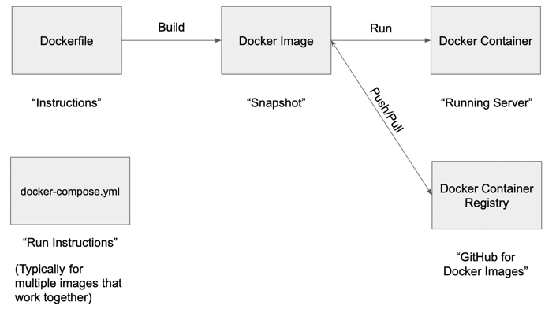

# Docker Demo

This is a minimal way to get started learning Docker.

### Files
- `docker_demo` directory - this is a simple Django project
    - `settings.py` - minimal settings, pulls MAGIC_MESSAGE setting from environment
    - `urls.py` - Has a TemplateView pointing at home.html and passing MAGIC_MESSAGE setting
    - `templates/home.html` - Home Page HTML
- `manage.py` - Docker management command file that invokes docker_demo project
- `Dockerfile` - Docker file to enable building an image containing python and this Django project
- `docker-compose.yml` - Docker Compose file to enable starting up Docker with common options
- `requirements.txt` - Python requirements file, used by Docker to install django in the image

### Commands

Build the Dockerfile into a runnable image:
- `docker build --tag docker-demo .`

Run the image you just built, exposing port 8000 on the host, pointing to port 8000 inside the container:
- `docker run -p 8000:8000 docker-demo`
- Ctrl-C to stop this ^^^

Run the image you just built, exposing port 8000 and setting the `MAGIC_MESSAGE` environment variable:
- `docker run -p 8000:8000 -e MAGIC_MESSAGE="Docker command line" docker-demo`
- Ctrl-C to stop this ^^^

Use Docker Compose to do the same thing:
- `docker-compose up`
- Ctrl-C to stop this ^^^

Tag the image to upload to a container registry:
- `docker tag docker-demo cyface/docker-demo:latest`

Upload the image to the container registry:
- `docker login`  (First time only)
- `docker push cyface/docker-demo:latest`

Retrieve an image from the container registry:
- `docker pull cyface/docker-demo:latest`

Run an image from the container registry:
- `docker run -p 8000:8000 -e MAGIC_MESSAGE="Docker command line" cyface/docker-demo`
- Try this from your machine!